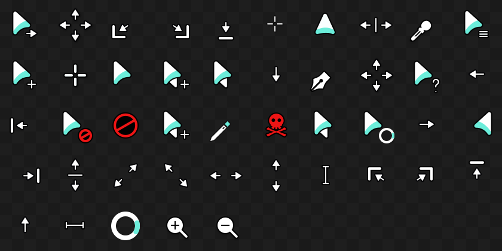

# ArcMidnight Cursors – Modified (No Hand)
An X cursor theme inspired by macOS and
based on [capitaine-cursors](https://github.com/keeferrourke/capitaine-cursors). Original version [here](https://github.com/yeyushengfan258/ArcMidnight-Cursors).

This version removes the hand-style pointer and other hand-based cursors, replacing them with a variation of the default arrow cursor for a more consistent look.

## Changes

Left: Default arrow cursor  
Right: This theme's new pointer cursor (this is the hand normally)  


## Full Preview


## Installation
To install the cursor theme simply copy the compiled theme to your icons
directory. For local user installation:

```
./install.sh
```

For system-wide installation for all users:

```
sudo ./install.sh
```

Then set the theme with your preferred desktop tools (i.e. Gnome Tweaks)

## Building from source
You'll find everything you need to build and modify this cursor set in
the `src/` directory. To build the xcursor theme from the SVG source
run:

```
./build.sh
```

This will generate the pixmaps and appropriate aliases.
The freshly compiled cursor theme will be located in `dist/`